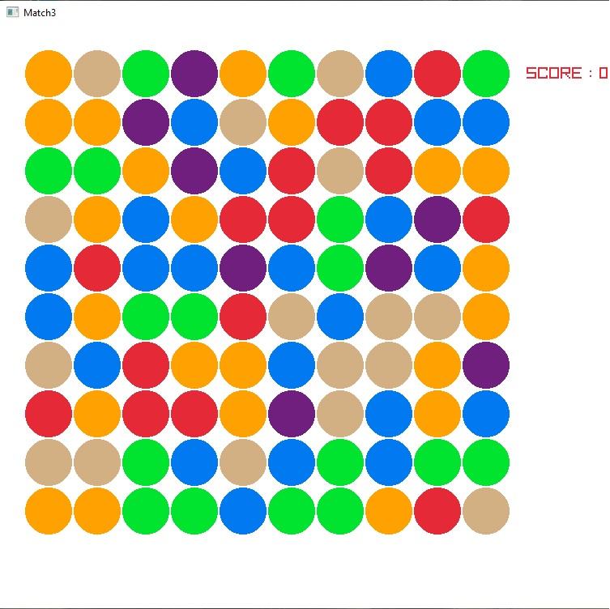

# match3
Simple match3 game made with [raylib](https://www.raylib.com/)

## Basic build instuctions 

1.clone this rep

2.Make a build directory in the top level directory: `mkdir build && cd build`

3.Compile: `cmake .. && make`

4.Run it: 
